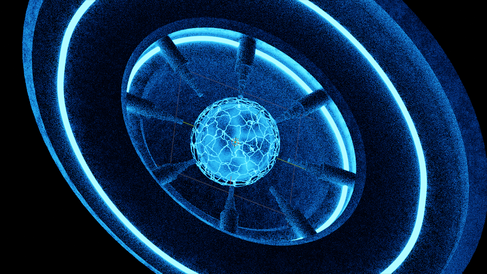

# PLASMA BALL Sci-Fi Scene in Blender

## Aperçu
Ce projet présente une scène futuriste de science-fiction mettant en vedette une boule de plasma créée entièrement dans Blender. Il vise à démontrer des techniques avancées d'éclairage, de conception de matériaux et de composition en utilisant les capacités puissantes de modélisation 3D et de rendu de Blender.

## Fonctionnalités
- **Modèle de Boule de Plasma**: Une boule de plasma hautement détaillée et réaliste avec des filaments de plasma complexes.
- **Environnement de Science-Fiction**: Un environnement futuriste immersif conçu pour compléter la boule de plasma.
- **Matériaux et Textures**: Des shaders et textures personnalisés créés pour les éléments de la scène.
- **Configuration d'Éclairage**: Techniques d'éclairage avancées pour améliorer l'atmosphère de science-fiction.
- **Rendu**: Des rendus de haute qualité montrant la scène sous différents angles et scénarios d'éclairage.

## Captures d'écran

## Utilisation
Pour explorer ou modifier la scène :
1. Clonez le dépôt 
2. Ouvrez le fichier `.blend` dans Blender.
3. Naviguez dans le viewport 3D pour explorer la scène.
4. Effectuez les modifications nécessaires.

## Licence
Ce projet est sous licence MIT - voir le fichier [LICENSE](LICENSE) pour plus de détails.

## Remerciements
- **Blender Foundation**: Pour le développement de Blender, une suite de création 3D open-source incroyable.
- **Tutoriels de la Communauté**: Divers tutoriels et ressources qui ont aidé à la création de ce projet.

## Contribuer
Les contributions sont les bienvenues ! Forkez le dépôt et soumettez une pull request avec vos améliorations.

## Contact
Pour des questions ou des suggestions, n'hésitez pas à nous contacter à [Ait Talla](https://aittalla-corporation.web.app/)
